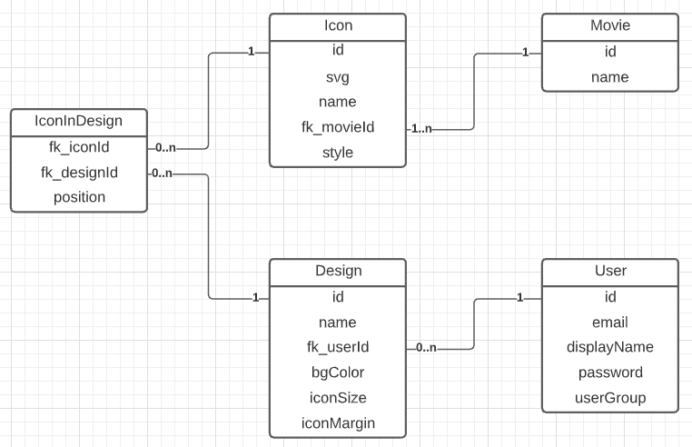

# **Projekt Fanicon**

Von Rouven Wicki &amp; Cedric Gasser

Klasse S-Inf18aL

23.04.2021

# Contents

[Starten](#Starten)

[Beschreibung](#Beschreibung)

[Nutzer](#Nutzer)

[- Gruppen](#Gruppen)

[- Personas](#Personas)

[User Stories](#User-Stories)

[- Allgemein](#Allgemein)

[- Design-Editor](#Design-Editor)

[Technologien](#Technologien)

# Starten

  * Start backend services in `docker` folder
    * `cd backend/docker; docker-compose up -d;`
  * Start `Fanicon` with gradle wrapper
    * `./backend/gradlew bootRun` (Linux)
    * `backend/gradlew.bat bootRun` (Windows)

# Beschreibung

Wir erstellen im M151 das Backend und im M152 das Frontend, was zusammen eine Webapp ergibt. Auf dieser Webapp soll man Icons auf einer Fläche anordnen, um sein eigenes Design zu kreieren. Die Webseite hat ein Login und eine Registrierungsfunktion.

# Nutzer

## Gruppen

### Normaler User

Der normale User kann aus Icons ein Design erstellen. Auch kann er Designs die andere veröffentlicht haben auswählen und für sich weiterbearbeiten. Designs werden verworfen, wenn man die Webseite verlässt.

### VIP User

Der VIP User kann auch ein Design erstellen und zusätzlich dieses abspeichern. Auch kann man als VIP User seine Designs veröffentlichen, damit andere diese suchen und verwenden können.

### Admin

Der Admin kann Icons hinzufügen und löschen. Als Admin soll man auch Designs erstellen können. Er soll auch Zugriff auf eine Liste von allen Usern haben, wo er die User filtern und suchen kann. Dort soll er auch die Nutzergruppe eines Users ändern können (Admin, VIP oder normaler User). Generell gesehen kann ein Admin alles machen was andere User auch können und mehr.

## Personas

### Lana Ming
Nutzergruppe: Admin

 

Sie ist ein Content-Creator und Designerin. Nutzt häufig unsere App, um ihre Designs und Icons hochzuladen. Sie braucht praktisch immer einen Desktop-PC und kennt sich sehr gut aus mit Computer.

### Jacob Balisong
Nutzergruppe: Admin

 

Er ist der Besitzer der App und hat diese mitentwickelt. Demensprechend hat er auch gute Computerkenntnisse. Er verwaltet hauptsächlich die User-Accounts und nutzt dazu das Admin-Interface unserer App wo er nach allen Usern suchen und filtern kann.

### Frizli
Nutzergruppe: Normaler User

 

Der Frizli kann sich noch nicht selbst einen VIP Account kaufen. Er kenn sich aber schon genügend mit der Technik aus und erstellt gerne Designs, welche er als Hintergrund bei seinem Schul-PC einstellt.

### Cole Sprouse
Nutzergruppe: VIP User

 

Cole hat Freude an cleanen Designs und kreiert immer wieder für sich und seine Kollegen Design, welche er auch als Sticker ausdruckt und auf diverse Gegenstände wie z.B. auf seinen Laptop draufklebt. Er kennt sich ebenfalls gut mit Computern aus und braucht unsere Web-App auch am Smartphone, um ein Design seinen Kollegen zu zeigen.

# User Stories

## Allgemein

### Registrieren

Als neuer Benutzer möchte ich mich mit Vornamen, Nachname, E-Mail-Adresse und Passwort registrieren können, um Zugang zum Design-Editor zu erhalten.

### Login

Als registrierter Benutzer möchte ich mit einloggen und den Design-Editor navigieren können, um dort ein neues Icon-Design zu erstellen.

### VIP (kaufen)

Als eingeloggter Standard-Benutzer soll ich penetrant (immer wieder/aufdringlich) auf die Möglichkeit hingewiesen werden, das VIP upgrade zu kaufen, sodass ich jederzeit ganz einfach dafür Geld ausgeben kann.

### Designs von VIPs verwenden

Als User möchte ich Designs, die von VIPs erstellt und abgespeichert wurden, auswählen, um dieses dann selbst in meinem Editor zu bearbeiten und zu verwenden.

## Design-Editor

### Design erstellen

Als eingeloggter Benutzer möchte ich im Editor Icons meiner Wahl auf einer Fläche anordnen, um ein Design zu kreieren und davon einen Screenshot aufnehmen zu können.

### Design speichern als VIP

Als VIP User kann ich ein Design, welches ich erstellt habe, abspeichern, um es später weiter zu bearbeiten und auch für andere User zu veröffentlichen.

### Icon-Library

Als User im Editor kann ich effizient und schnell nach Icons suchen, um diese meinem Design hinzuzufügen.

### Anpassbare Parameter

Als User im Editor kann ich diverse Parameter wie Farbe, Grösse und Abstand etc. einstellen, um mein Design einzigartig nach meinem Geschmack zu gestallten.

### Drag &amp; Drop aus Icon-Library (Optional)

Als User im Editor kann ich Icons aus der Library oder aus dem Design per Drag &amp; Drop herumschieben, um schnell und einfach die Icons anzuordnen.

# Technologien

Im Backend haben wir eine Java-Applikation, die eine PostgreSQL-Datenbank verwendet, welche in einem Docker-Container laufen wird. Das Frontend soll auf einem Deno-Webserver laufen und in JavaScript und TypeScript geschrieben sein. Folgende Technologien werden genutzt:

- Docker (Postgres DB)
- Java
- Sessions
- Caching
- DB Migrationsscripts
- Spring
- Deno
- Java- / Typescript
- HTML &amp; CSS

# ERD

